# Advanced CI/CD Pipeline - Task Management API

<div align="center">


[](https://codecov.io/gh/username/task-api)
[](https://opensource.org/licenses/MIT)
[](https://nodejs.org/)

**Production-grade REST API with comprehensive CI/CD pipeline**

> Enterprise-level DevOps practices with automated testing, security scanning, and blue-green deployment

[Architecture](#-architecture) • [Quick Start](#-quick-start) • [API Docs](#-api-documentation) • [CI/CD](#-cicd-pipeline) • [Deployment](#-deployment)

</div>

---

## 🚀 Project Overview

Enterprise-level REST API demonstrating **advanced DevOps and CI/CD practices**. Features automated testing, security scanning, Docker containerization, and multi-environment deployment with blue-green strategy.

### ✨ Key Highlights

- **8-stage CI/CD pipeline** with automated quality gates
- **Zero-downtime deployments** using blue-green strategy
- **Comprehensive testing** (unit, integration, performance) with 74%+ coverage
- **Security-first approach** with multiple scanning tools (Snyk, CodeQL, Trivy)
- **Production-ready** monitoring, logging, and health checks
- **Scalable architecture** with Docker and AWS ECS Fargate
- **Multi-stage Docker builds** optimized to < 200MB
- **API versioning** with Swagger/OpenAPI documentation

---

## 📋 Table of Contents

- [Tech Stack](#-tech-stack)
- [Architecture](#-architecture)
- [Prerequisites](#-prerequisites)
- [Quick Start](#-quick-start)
- [API Documentation](#-api-documentation)
- [Testing](#-testing)
- [CI/CD Pipeline](#-cicd-pipeline)
- [Deployment](#-deployment)
- [Security](#-security)
- [Monitoring](#-monitoring)
- [Project Structure](#-project-structure)
- [Troubleshooting](#-troubleshooting)

---

## 🛠️ Tech Stack

| Category | Technologies |
|----------|-------------|
| **Runtime** | Node.js 18+, Express.js |
| **Database** | PostgreSQL 15, Redis 7 |
| **Authentication** | JWT, bcrypt (12 rounds) |
| **Testing** | Jest, Supertest, k6 |
| **Security** | Helmet, express-validator, Snyk, CodeQL, Trivy |
| **CI/CD** | GitHub Actions, Docker, AWS ECS |
| **Monitoring** | CloudWatch, Winston Logger |
| **Documentation** | Swagger/OpenAPI 3.0 |
| **Containerization** | Docker, Docker Compose, Nginx |

---

## 🏗️ Architecture

### System Architecture


### CI/CD Pipeline Flow


### Database Schema


---

## 🛠️ Prerequisites

### Required

- **Node.js** >= 18.0.0
- **npm** >= 9.0.0
- **Docker** >= 20.10 and Docker Compose >= 2.0
- **Git** >= 2.30

### Optional (for production deployment)

- **PostgreSQL** >= 15 (for local development without Docker)
- **AWS Account** with ECS/ECR access
- **GitHub Account** for CI/CD automation

---

## 🚦 Quick Start

### 1. Clone the Repository

```bash
git clone https://github.com/username/task-api.git
cd task-api
```

### 2. Environment Configuration

```bash
# Copy environment template
cp .env.example .env

# Edit .env with your configuration
```

**Required Environment Variables:**

```env
NODE_ENV=development
PORT=3000
DB_HOST=localhost
DB_PORT=5432
DB_NAME=taskdb
DB_USER=taskuser
DB_PASSWORD=your_secure_password
JWT_SECRET=your_jwt_secret_key
REDIS_HOST=localhost
REDIS_PORT=6379
```

### 3. Using Docker Compose (Recommended)

```bash
# Start all services (PostgreSQL, Redis, API, Nginx)
docker-compose up -d

# View logs
docker-compose logs -f api

# Check container status
docker ps
```

**Wait for services to be ready (about 30 seconds), then:**

```bash
# Run database migrations
docker exec task_api npm run migrate

# Seed database with sample data (optional)
docker exec task_api npm run seed
```

The API will be available at `http://localhost:3000` or `http://localhost` (via Nginx)

### 4. Local Development (Without Docker)

```bash
# Install dependencies
npm install

# Set up database (PostgreSQL must be running)
npm run migrate

# Seed database with sample data (optional)
npm run seed

# Start development server with hot reload
npm run dev
```

### 5. Verify Installation

```bash
# Health check
curl http://localhost:3000/api/health
```

**Expected Response:**

```json
{
  "status": "ok",
  "timestamp": "2025-10-13T12:00:00.000Z",
  "services": {
    "database": "connected",
    "redis": "connected"
  },
  "version": "1.0.0"
}
```

---

## 📚 API Documentation

### Access Interactive Documentation

Once the application is running, visit:

- **Swagger UI**: `http://localhost:3000/api-docs`
- **OpenAPI JSON**: `http://localhost:3000/api-docs.json`

### Quick API Reference

| Method | Endpoint | Description | Auth |
|--------|----------|-------------|------|
| GET | `/api/health` | Health check | No |
| POST | `/api/v1/auth/register` | Register user | No |
| POST | `/api/v1/auth/login` | Login user | No |
| GET | `/api/v1/auth/me` | Get current user profile | Yes |
| GET | `/api/v1/tasks` | List all tasks | Yes |
| POST | `/api/v1/tasks` | Create new task | Yes |
| GET | `/api/v1/tasks/:id` | Get specific task | Yes |
| PUT | `/api/v1/tasks/:id` | Update task | Yes |
| DELETE | `/api/v1/tasks/:id` | Delete task | Yes |

### Example Requests

**Register a User:**

```bash
curl -X POST http://localhost:3000/api/v1/auth/register \
  -H "Content-Type: application/json" \
  -d '{
    "email": "user@example.com",
    "password": "Password123!",
    "name": "John Doe"
  }'
```

**Login:**

```bash
curl -X POST http://localhost:3000/api/v1/auth/login \
  -H "Content-Type: application/json" \
  -d '{
    "email": "user@example.com",
    "password": "Password123!"
  }'
```

**Create a Task:**

```bash
curl -X POST http://localhost:3000/api/v1/tasks \
  -H "Content-Type: application/json" \
  -H "Authorization: Bearer YOUR_JWT_TOKEN" \
  -d '{
    "title": "Complete project",
    "description": "Finish the API development",
    "priority": "high",
    "status": "in_progress",
    "dueDate": "2025-10-20"
  }'
```

**Get All Tasks:**

```bash
curl -X GET "http://localhost:3000/api/v1/tasks?status=pending&page=1&limit=10" \
  -H "Authorization: Bearer YOUR_JWT_TOKEN"
```

---

## 🧪 Testing

### Run All Tests

```bash
# Run all tests with coverage
npm test
```

### Run Tests with Coverage

```bash
npm run test:coverage
```

**Current Coverage:** 74%+ across all categories

After running, open `coverage/lcov-report/index.html` in your browser.

### Run Integration Tests Only

```bash
npm run test:integration
```

### Run Tests in Watch Mode

```bash
npm run test:watch
```

### Performance Testing

```bash
npm run test:performance
```

**Sample Performance Test Output:**

```
✓ http_req_duration..............: avg=45.2ms  min=12.3ms  med=38.7ms  max=234.5ms
✓ http_req_failed................: 0.00%  ✓ 0     ✗ 5000
✓ http_reqs......................: 5000   166.67/s
checks........................: 100.00% ✓ 15000    ✗ 0
```

---

## 🔄 CI/CD Pipeline

### Pipeline Stages

```mermaid
graph TD
    A[Push to GitHub] --> B[Stage 1: Code Quality]
    B --> C[Stage 2: Security Scanning]
    C --> D[Stage 3: Unit Testing]
    D --> E[Stage 4: Build Docker Image]
    E --> F[Stage 5: Integration Testing]
    F --> G[Stage 6: Performance Testing]
    G --> H[Stage 7: Deploy to Staging]
    H --> I{Health Check}
    I -->|Pass| J[Stage 8: Deploy to Production]
    I -->|Fail| K[Rollback & Alert]
    J --> L{Smoke Tests}
    L -->|Pass| M[Complete ✓]
    L -->|Fail| N[Auto Rollback]
    
    style A fill:#4078c0
    style B fill:#6f42c1
    style C fill:#d73a49
    style D fill:#28a745
    style E fill:#0366d6
    style J fill:#28a745
    style K fill:#d73a49
    style N fill:#d73a49
```



### Stage Details

| Stage | Tools | Duration | Purpose |
|-------|-------|----------|---------|
| **1. Code Quality** | ESLint, Prettier | ~1 min | Enforce coding standards |
| **2. Security Scan** | npm audit, Snyk, CodeQL, Trivy | ~2 min | Detect vulnerabilities |
| **3. Unit Tests** | Jest, Supertest | ~2 min | Verify code functionality |
| **4. Build** | Docker multi-stage | ~3 min | Create optimized image |
| **5. Integration** | Jest + Docker Compose | ~2 min | Test API endpoints |
| **6. Performance** | k6 load testing | ~2 min | Validate performance |
| **7. Staging** | AWS ECS Fargate | ~4 min | Deploy to test environment |
| **8. Production** | AWS ECS blue-green | ~5 min | Zero-downtime deployment |

**Total Pipeline Time:** ~21 minutes

### GitHub Secrets Required

Configure these secrets in your GitHub repository settings:

```
AWS_ACCESS_KEY_ID           # AWS credentials for deployment
AWS_SECRET_ACCESS_KEY       # AWS secret key
CODECOV_TOKEN               # Codecov integration
SNYK_TOKEN                  # Snyk security scanning
SLACK_WEBHOOK_URL           # Slack notifications (optional)
DOCKER_HUB_USERNAME         # Docker Hub credentials (optional)
DOCKER_HUB_TOKEN            # Docker Hub token (optional)
```

---

## 🚀 Deployment

### Local Development

```bash
# Start all services
docker-compose up -d

# View logs
docker-compose logs -f

# Stop services
docker-compose down

# Restart specific service
docker-compose restart api
```

### Deploy to AWS ECS/Fargate

#### Prerequisites

- AWS account with ECS configured
- ECR repository created
- ECS cluster running

#### Manual Deployment

```bash
# Build and tag image
docker build -t task-api:latest .

# Tag for ECR
docker tag task-api:latest <account-id>.dkr.ecr.us-east-1.amazonaws.com/task-api:latest

# Login to ECR
aws ecr get-login-password --region us-east-1 | docker login --username AWS --password-stdin <account-id>.dkr.ecr.us-east-1.amazonaws.com

# Push to ECR
docker push <account-id>.dkr.ecr.us-east-1.amazonaws.com/task-api:latest

# Update ECS service
aws ecs update-service \
  --cluster production-cluster \
  --service task-api \
  --force-new-deployment
```

#### Automated Deployment

The CI/CD pipeline automatically deploys:

- **Staging**: On every push to `main` branch
- **Production**: On manual approval or tagged releases

### Environment Configuration

**Staging:**
- URL: `https://staging.taskapi.com`
- Database: RDS staging instance
- Auto-deploy enabled

**Production:**
- URL: `https://api.taskapi.com`
- Database: RDS production instance
- Manual approval required
- Blue-green deployment strategy

---

## 🔒 Security

### Implemented Security Measures

- ✅ **Helmet.js** for secure HTTP headers
- ✅ **CORS** configuration with whitelist
- ✅ **Rate limiting** (100 req/15min general, 5 req/15min auth)
- ✅ **JWT authentication** with secure token handling
- ✅ **bcrypt password hashing** (12 rounds)
- ✅ **Input validation** and sanitization with express-validator
- ✅ **SQL injection protection** via parameterized queries
- ✅ **Environment variable secrets** (no hardcoded credentials)
- ✅ **Non-root Docker user** for container security
- ✅ **Automated security scanning** (Snyk, CodeQL, Trivy)
- ✅ **Dependency vulnerability checks** in CI/CD
- ✅ **Secret detection** with TruffleHog

### Rate Limiting Configuration

- **General API**: 100 requests per 15 minutes per IP
- **Authentication endpoints**: 5 requests per 15 minutes per IP
- Configurable via environment variables

---

## 📈 Monitoring & Observability

### Health Endpoints

- `GET /api/health` - Application health status with dependency checks
- `GET /api/metrics` - Application metrics (optional)
- `GET /api/ready` - Kubernetes-style readiness probe

### Logging

Structured JSON logging with Winston:

- **Info level**: General application events
- **Error level**: Errors and exceptions with stack traces
- **Debug level**: Detailed debugging (development only)

Logs are stored in:
- `logs/error.log` - Error logs only
- `logs/combined.log` - All application logs

### Monitoring Integration

Configure these optional services:

- **AWS CloudWatch** - Metrics, logs, and alarms
- **Sentry** - Error tracking and performance monitoring (optional)
- **New Relic** - Application performance monitoring (optional)

---

## 📁 Project Structure

```
cicd-pipeline/
├── .github/
│   └── workflows/
│       └── ci-cd-pipeline.yml        # Complete CI/CD workflow
├── src/
│   ├── config/
│   │   ├── database.js               # PostgreSQL connection pool
│   │   └── swagger.js                # API documentation setup
│   ├── controllers/
│   │   ├── auth.controller.js        # Authentication logic
│   │   └── task.controller.js        # Task CRUD operations
│   ├── database/
│   │   ├── migrate.js                # Database migrations
│   │   └── seed.js                   # Sample data seeding
│   ├── middleware/
│   │   ├── auth.js                   # JWT verification
│   │   ├── errorHandler.js           # Global error handling
│   │   └── rateLimiter.js            # Rate limiting
│   ├── routes/
│   │   ├── auth.routes.js            # Auth endpoints
│   │   ├── task.routes.js            # Task endpoints
│   │   ├── image.routes.js           # Image proxy endpoints
│   │   └── health.routes.js          # Health checks
│   ├── tests/
│   │   ├── auth.test.js              # Authentication tests
│   │   ├── health.test.js            # Health check tests
│   │   └── setup.js                  # Test configuration
│   ├── utils/
│   │   └── logger.js                 # Winston logger
│   └── server.js                     # Express app entry point
├── scripts/
│   ├── init-db.sql                   # Database initialization
│   ├── performance-test.js           # k6 performance tests
│   └── backup-db.js                  # Database backup utility
├── nginx/
│   └── nginx.conf                    # Reverse proxy configuration
├── Dockerfile                        # Multi-stage Docker build
├── docker-compose.yml                # Local development setup
├── package.json                      # Dependencies & scripts
├── jest.config.js                    # Jest configuration
├── .eslintrc.js                      # ESLint rules
├── .prettierrc                       # Code formatting
├── .env.example                      # Environment template
├── .gitignore                        # Git ignore rules
└── README.md                         # This file
```

---

## 🔧 Available Scripts

| Script | Description |
|--------|-------------|
| `npm start` | Start production server |
| `npm run dev` | Start development server with hot reload |
| `npm test` | Run all tests |
| `npm run test:watch` | Run tests in watch mode |
| `npm run test:integration` | Run integration tests only |
| `npm run test:coverage` | Run tests with coverage report |
| `npm run test:performance` | Run k6 performance tests |
| `npm run lint` | Run ESLint |
| `npm run lint:fix` | Fix ESLint errors automatically |
| `npm run format` | Format code with Prettier |
| `npm run format:check` | Check code formatting |
| `npm run migrate` | Run database migrations |
| `npm run migrate:rollback` | Rollback last migration |
| `npm run seed` | Seed database with sample data |
| `npm run db:backup` | Backup database |

---

## 🐛 Troubleshooting

### Docker Issues

**Port 80 already in use:**

```bash
# Windows
netstat -ano | findstr :80
taskkill /PID <pid> /F

# Linux/Mac
lsof -i :80
kill -9 <pid>
```

**Database connection failed:**

```bash
# Check database logs
docker logs task_db

# Check database readiness
docker exec task_db pg_isready -U taskuser

# Restart PostgreSQL
docker-compose restart postgres
```

**Containers not starting:**

```bash
# Check Docker daemon
docker --version
docker ps

# View all containers (including stopped)
docker ps -a

# Restart all services
docker-compose down
docker-compose up -d
```

### Application Issues

**Migration errors:**

```bash
# Reset migrations
docker exec task_api npm run migrate:rollback
docker exec task_api npm run migrate
```

**Tests failing:**

```bash
# Clear Jest cache
npm test -- --clearCache

# Run tests in verbose mode
npm test -- --verbose
```

---

## 📊 Key Metrics

- **API Response Time:** < 50ms (p95), < 100ms (p99)
- **Test Coverage:** 74%+ (statements, branches, functions, lines)
- **Docker Image Size:** < 200MB (multi-stage optimized)
- **Build Time:** ~3 minutes (Docker multi-stage)
- **Deployment Time:** ~5 minutes (blue-green strategy)
- **Zero Downtime:** Guaranteed with blue-green deployment
- **Pipeline Success Rate:** 95%+ on main branch

---

## 🤝 Contributing

1. Fork the repository
2. Create your feature branch (`git checkout -b feature/AmazingFeature`)
3. Commit your changes (`git commit -m 'Add some AmazingFeature'`)
4. Push to the branch (`git push origin feature/AmazingFeature`)
5. Open a Pull Request

---

## 📝 License

This project is licensed under the MIT License - see the [LICENSE](LICENSE) file for details.

---

## 👤 Author

**DevOps Portfolio Project**

- GitHub: [@username](https://github.com/naveed-gung)
- LinkedIn: [Your Name](https://www.linkedin.com/in/naveed-sohail-gung-285645310/)

---

## 🙏 Acknowledgments

- Express.js team for the excellent framework
- GitHub Actions for the powerful CI/CD platform
- AWS for robust cloud infrastructure
- The open-source community for amazing tools

---

## 📅 Roadmap

- [ ] GraphQL API support
- [ ] WebSocket real-time updates
- [ ] Multi-region deployment with Route53
- [ ] Kubernetes manifests and Helm charts
- [ ] Terraform infrastructure as code
- [ ] Mobile app integration
- [ ] Advanced caching strategies
- [ ] Observability dashboard with Grafana

---

<div align="center">

**Built as a DevOps Portfolio Project**


**⭐ Star this repository if you find it helpful!**

</div>
